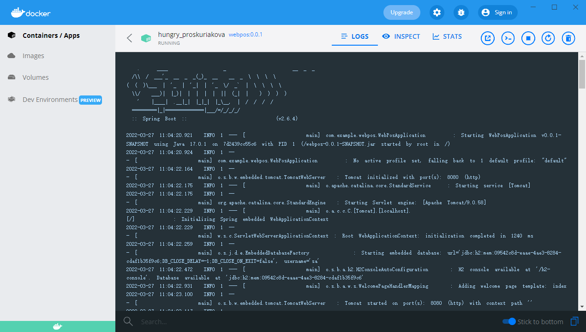
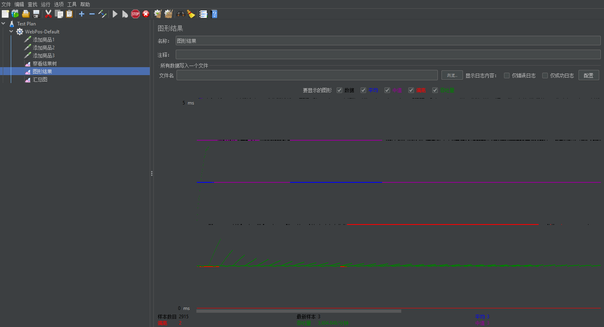
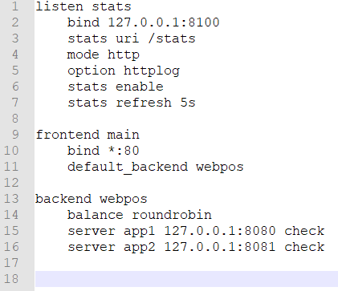
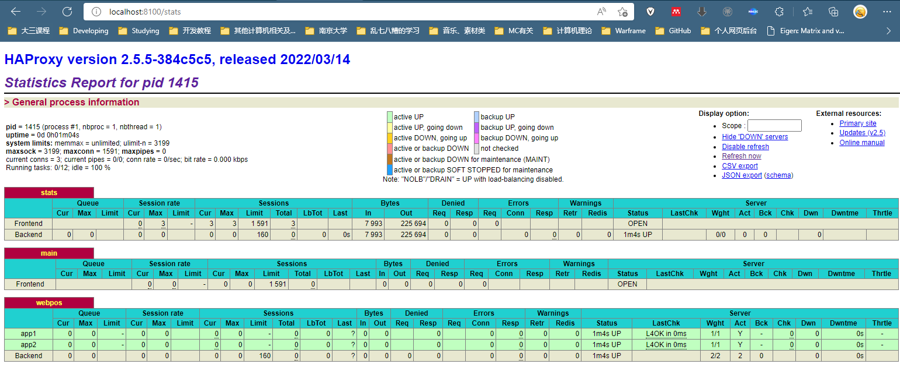
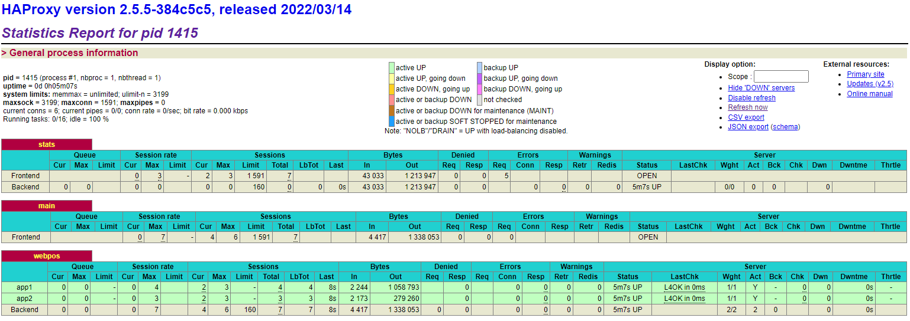
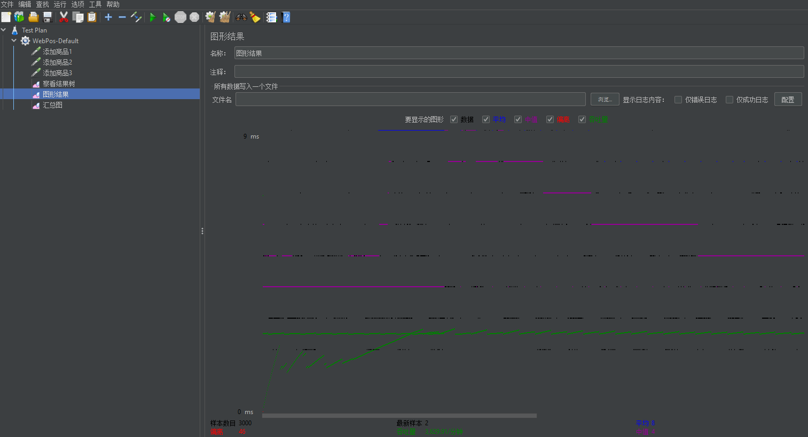
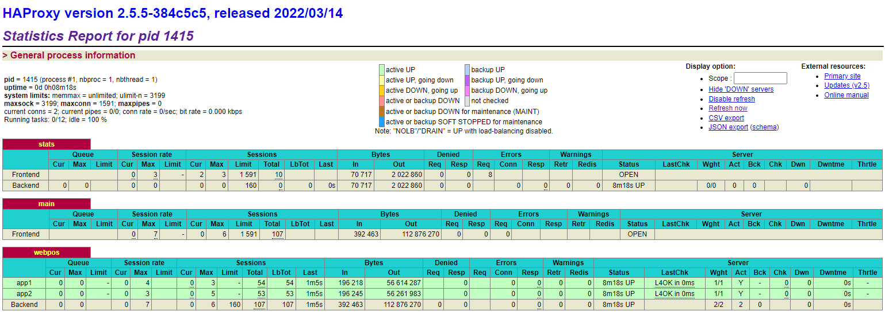
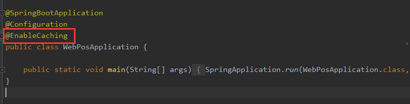
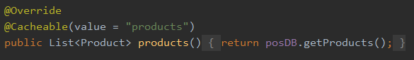

# WebPOS

The demo shows a web POS system , which replaces the in-memory product db in aw03 with a one backed by 京东.


To run

```shell
mvn clean spring-boot:run
```

Currently, it creates a new session for each user and the session data is stored in an in-memory h2 db. 
And it also fetches a product list from jd.com every time a session begins.

1. Build a docker image for this application and performance a load testing against it.
2. Make this system horizontally scalable by using haproxy and performance a load testing against it.
3. Take care of the **cache missing** problem (you may cache the products from jd.com) and **session sharing** problem (you may use a standalone mysql db or a redis cluster). Performance load testings.

Please **write a report** on the performance differences you notices among the above tasks.


# Report

1. 部署在docker上




JMeter 负载测试 (实际上压力测试)





2. 水平扩展

首先再部署一个app到docker上，端口8081

安装haproxy并配置



千辛万苦终于运行成功haproxy



貌似有点小问题，刷新网页有的时候没有商品，不过不要紧

我们随便访问 127.0.0.1:80，可以发现这边 haproxy 已经有记录了



接下来再次运行 JMeter 压测，端口改成 80



这是 haproxy 统计页面




3. Cache

开启 Cache



添加 Cacheable



也改了Session

通过计时和logging方式验证了这个Cache可以生效，不会重复访问 posDB.getProducts()，于是重新打包并重新部署到docker上，进行JMeter压测


总感觉13差不多，然后2的话偏离更多一些看上去更不稳定，不知道为什么。。。